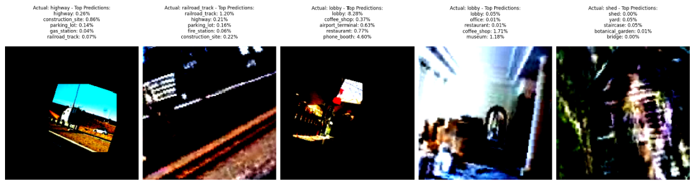

# Scene Recognition (Places2 — ResNet Transfer Learning)

Notebook-first, cleaned implementation of **scene recognition** using **ResNet-34/50** with transfer learning on the
**Places2 simplified** dataset (40 classes). The pipeline mirrors a typical research workflow and is heavily commented
for readability.

## Example Results

<p align="center">
  <br/>
  <em>Correctly Predicted Images from Validation Set (top-5 probabilities shown).</em>
</p>

<p align="center">
  <br/>
  <em>Validation results comparing ResNet‑34 and ResNet‑50.</em>
</p>

## Pipeline
1. **Dataset & Dataloaders** — stratified 80/20 split, augmentations, and loaders.
2. **Train ResNet** — dual learning rates (backbone/head), StepLR (every 6 epochs), early stopping by val loss,
   and best-checkpoint saving; logs Top‑1/Top‑5, F1‑macro, mAP.
3. **Evaluate & Visualise** — confusion matrix, classification report, and feature‑map hooks.

## Repo Layout
```
notebooks/
  01_dataset_and_dataloaders.ipynb
  02_train_resnet_transfer.ipynb
  03_evaluate_and_visualise.ipynb

docs/images/
  val_correct_examples.png     # shown above
  results_table.png            # shown above
  confusion_val.png            # created by notebook 03
  featuremaps_conv1.png        # created by notebook 03
```
(Notebook 03 will regenerate the evaluation plots under `docs/images/`.)

## Quickstart
- Install deps:
```bash
pip install torch torchvision torchaudio
pip install numpy pandas scikit-learn matplotlib seaborn tqdm
```
- Set `DATA_ROOT` paths inside the notebooks to your extracted **Places2_simp** folder.
- Run notebooks in order: `01 → 02 → 03`. The best model is saved under `checkpoints/` and evaluation plots in `docs/images/`.

## Key Choices
- **Augmentations:** resized crop to 224, flip, ±20° rotation, ImageNet mean/std.
- **Transfer:** swap ResNet FC for Dropout(0.5)+Linear(#classes).
- **Dual LR:** e.g., `1e-4` backbone vs `1e-3` head (configurable).
- **Scheduler:** StepLR with `step_size=6`, `gamma=0.6` (configurable).
- **Early stopping:** patience=10 on validation loss.

## Metrics
- **Top‑1/Top‑5 accuracy**, **F1‑macro**, **mAP (OvR)**, and **confusion matrix**.
- Example plots are saved under `docs/images/` by notebook 03.

## References
- He et al., *Deep Residual Learning for Image Recognition*, 2015.
- Zhou et al., *Places: A Database for Scene Understanding*, 2016.